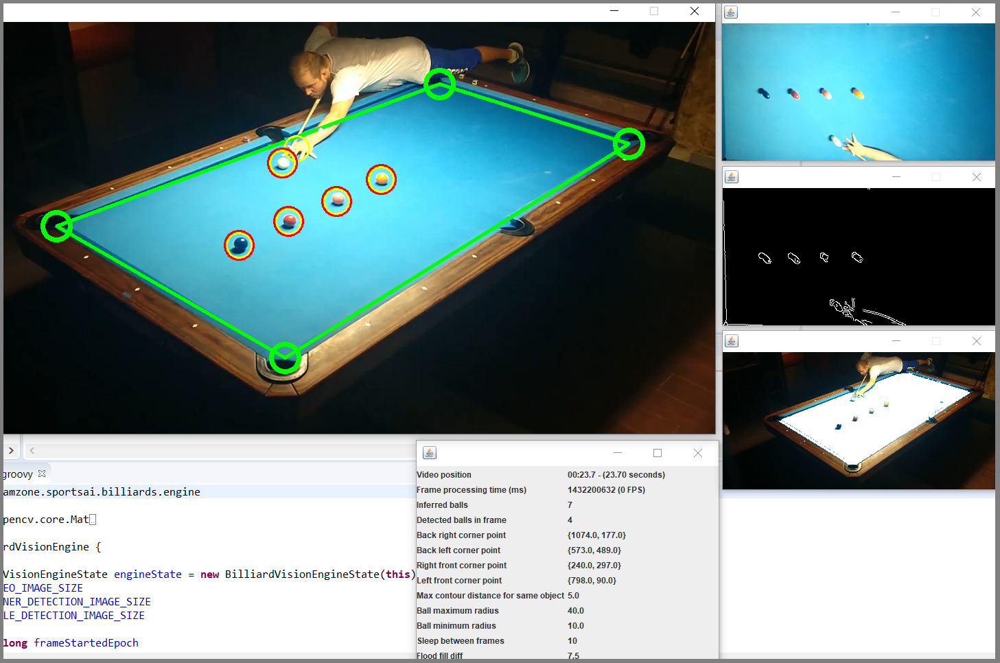

# BCVE: Billiards Computer Vision Engine - Prototype

This is a hobby project or prototype of a recognition system of billiard table and its balls in real-time, that anyone
can afford. A normal mobile phone is set up over the table and used to send a video signal to a computer that
runs computer vision algorithms to detect the table and balls on the table in real-time. 

## Links to show the engine running

1) [Short demonstration video](http://projects.fearlessit.fi/videos/pool_vision_demo.mp4)
2) [The operating principle of the engine with line-up drill](http://projects.fearlessit.fi/videos/billiard_vision_example.mp4)

## Process of detecting table and balls

Key elements of used detecting decisions are described here. Details are left to read from the code. The project
is a prototype, much of the work is done by experimenting and not knowing the outcome. Still, the code is tried to keep 
readable and open for new ideas and development. Main recognition process is implemented in *BilliardVisionEngine*
class.

### Detecting table

The play area consists of a flat surface that lies between corners. The camera stand should be placed so that it contains as
much of the table surface as possible. Normally, this is near the roof and near some corner of the table. The optimal place would be 
straight over the table's middle point, but this is practically impossible because the necessary light source for the game 
blocks the view.

Corners of the table are detected using OpenCV's *floodFill* method. This is basically the same method that Windows Paint
has the bucket icon and it will paint all the same color surface with the given color. It is a recursive algorithm that
examines neighbor pixels and if they are the same color, or close enough in this case, they get painted white. Starting 
point is chosen in the center of the image with little experiments nearby in case there would be a ball or cue there. After
fill is executed we have an all-white playing surface and detecting corners is straightforward. We assume that the table 
is not often moved so we don't have to check corners for every frame. If detecting corners is not as accurate as 
wanted or will completely fail, then a mouse can be used to force corner positions. 

### Detecting balls

The playing area is transformed to a rectangle shape with OpenCV's *warpPerspective* method. For ball recognition, we are
interested in edges in the image so OpenCV's *canny* operation is now executed to find edges. After that, we get all
contours with the *findContours* method. We examine these contours and if they are suitably sized and near each other
then they are determined as a ball. If they constitute too big (or small) objects by radius, such as a player or cue, 
they are skipped. Balls are detected on every frame and if one is moving linearly it is determined as a moving ball.
If an object is not behaving with linear speed it is ditched as it can't be a ball. We have a method to detect is ball
moving or not, based on previous frames so that it is possible to recognize the start and end points of one turn.

These steps to detect tables and balls are illustrated in the above picture (engine_snapshot.png). Every screen illustrates
one step of the process. In the final image, balls are pointed with yellow circles and not moving balls with extra
red circles. The automatically detected playing surface is illustrated with green circles and lines.

### Challenges of recognition and possible applications

As we only use one camera there are limitations to the accuracy of the system. Also, players can temporarily block the view.
Perspective gets skewed and especially far from camera detection accuracy suffers. This process doesn't
do well with balls too near each other. It will determine them as one ball or skip them entirely as they are too
big to be one ball.

That being said, this prototype of a very simple detection process still works pretty well. It doesn't output 100% correct
output all of the time, but in many applications, this is not even necessary. For example, with this setup, it could be
possible to implement an automatic score counter for a straight pool. This could be achieved by examining ball movements
and numbers on table and by recognizing the pocketing of the moving ball.

One interesting application is training billiards as a computer engine is able to keep track of shots and for example
average accuracy. If you are interested in applying for this project but need some technical help, please do not hesitate to
contact me.

## Installation and running BCVE engine

BCVE engine uses the OpenCV graphics library. Because of highly optimized low-level implementation, it is written in C++.
It supports Windows, Mac, and Linux, but must be natively installed. To run it with Java as we do here you can check
instructions from OpenCV's documentation or from here:
https://medium.com/javarevisited/setting-up-opencv-for-java-44c6eb6ae7e1 . After installation of OpenCV, you only
need JRE to run BCVE and Groovy if you want to build and develop it.

BCVE engine can also be used in offline mode where online video streaming is replaced with pre-recorded video files.
Or it can be used in real-time by connecting the computer's webcam to the OpenCV input stream. This can be done using a separate
mobile web camera or by using a mobile phone as a computer's webcam. I have used the DroidCamX app for this as it is free
(or a little cost for the pro version) and easy to use.

Full setup of BCVE engine requires:
	
	- Billiard table and balls
	- Mobile phone or external webcam that can record video and phone stand located high
	  on some corners of the table
	- Computer to run this Billiards Computer Vision Engine. Computer requirements:
		- JRE installed
		- OpenCV framework installed 
		- Groovy installed if you want to develop and build new versions of BCVE
	- With online mode DroidCamX app or other web camera system to stream video source to BCVE engine
	
Offline mode is set as default to test and run the engine first. After you get offline mode work you can set it online
mode, which, of course, is more interesting in practice. 

## Installation and running of BCVE engine in offline mode

List of dependencies needed to run the BCVE engine in offline mode with a pre-recorded video file (included with the project)
is listed here. With all dependencies, it is possible that newer and in some cases older versions work fine too. But if you
want to be sure I also list exact version numbers that are tested to work.

	1. I have used Windows with development but this project should be operating system independent
	2. JRE is needed to run BCVE-engine (Java 8)
	3. OpenCV (https://opencv.org/). Choose OpenCV according to your operating system (version 3.4.2)
	4. Optionally Groovy is needed if you want to develop and build new versions of the engine (Groovy 2.5)

I have used Eclipse IDE for development. I share this project as an Eclipse project and give instructions to run
this through Eclipse. However, you don't need Eclipse to run this project and run it with your own choice of
IDE or command line is as straightforward as running a Java program is. I have also shared binaries (./bin/ directory)
in Git repository so you don't necessarily need Groovy as JRE is sufficient. 

`Run VideoInputApplication class (fi.samzone.sportsai.billiards.ui.videosource.VideoInputApplication.class/groovy)`

If you run the BCVE engine with Eclipse IDE, ensure you have OpenCV and Groovy listed in your Run Configuration's Dependencies
tab. In Eclipse you can run it with "Run as Java application" (do not use Run as Groovy console, because it doesn't work). If
you don't use Eclipse just run the VideoInputApplication class with OpenCV linked the proper way depending on your OS and  by following
OpenCV installation documents. You can also check out
[my instructions to add OpenCV support to the Eclipse project](LinkOpenCvToJavaProject.md).

## Installation and running of BCVE engine in online mode

Change **online_mode=true** in ./default.properties file. Try to run VideoInputApplication and if you are using a laptop with a webcam
open you should see yourself and the BCVE engine's interpretation of the image. This of course is a mesh and the next thing you need to do
is install DroidCamX or another mobile app that can be used as input for the webcam of your computer. OpenCV gives an identifying number
for every input video source. If you run BCVE with a laptop computer and mobile phone, the right input ID is number 1 as the number zero is
taken by the laptop's default webcam. If you have a different setup you can change the OpenCV video input number from ./default.properties file.

## Running BCVE server

To scale up BCVE to multiple instances there is a separate server and listening clients model implemented. These can be found under
package *fi.samzone.sportsai.billiards.engine.net*. This work is still under construction and the best way to explore it is through
source code.

## Regards

If you try this project and have some fun or useful benefits with it I would love to hear. Maybe you have some application for it
or maybe you have done something similar? Or even if you want to develop it (it sure could use more work...) or have problems running it.
Don't hesitate to contact me.

Sampo Yrjänäinen (Samzone),
sampo@fearlessit.fi,
www.fearlessit.fi
